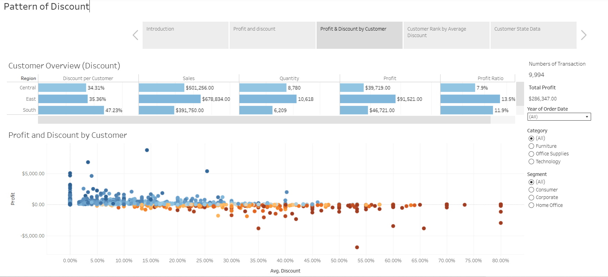
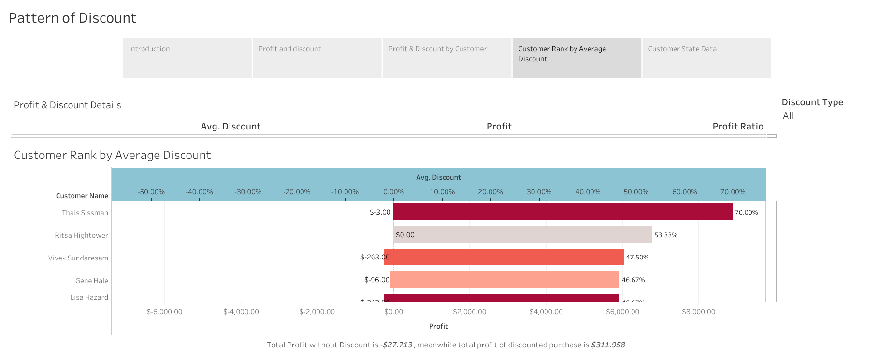

# Tableau Story: Customer Profitability & Discount Impact

## Objective
This interactive Tableau story was built for business stakeholders at a fictional retail company, seeking to understand **how discounting affects customer profitability** and to identify **top-performing vs underperforming customers**.

The dashboard explores:
- Net profit contribution by customer
- Average discount vs profit margin impact
- High-level KPIs across all customers

---

## Audience
This report was designed for **non-technical stakeholders** (e.g., sales execs, finance managers), emphasizing **clarity**, **color signaling**, and **interactive filtering**.

---

## Key Design Choices

1. **Color-coded Profit Ratio**  
   Red for negative, blue for positive - immediate visual cue for decision makers.

2. **Customer-level Filtering with Actions**  
   Allows stakeholders to zoom in on a single customer and track how their discount behavior impacts profit.

3. **KPI Cards for Executive Snapshot**  
   Total Profit, Avg. Discount, and Avg. Profit Ratio provided upfront for decision-making speed.

---

## Visual Structure

- **Tab 1**: Introduction
- **Tab 2**: Profit and Discount for Selected Customers  
- **Tab 3**: Profit and Discount Scatter Plot  
- **Tab 4**: Customer Ranking by Avg. Discount 
- **Tab 5**: Customer State Data

---

## 🔗 Live Dashboard

🌐 [View Tableau Public Dashboard](https://public.tableau.com/views/FinalTableauCourseraProject/PatternofDiscount?:language=en-US&publish=yes&:sid=&:redirect=auth&:display_count=n&:origin=viz_share_link)

---
## Insights

| Insight                                                                      | Evidence                                                                                                                       |
| ---------------------------------------------------------------------------- | ------------------------------------------------------------------------------------------------------------------------------ |
| ❌ **High discounts don't always yield profit**                               | Top 3 customers with avg. discounts > 45% (e.g., Thais Sissman at 70%) still generated **low or even negative** profit margins |
| ❗ **Several customers with discounts are unprofitable**                      | Customers like Tom Prescott and Anthony Garverick received 46%+ discounts yet caused **significant losses** (red bars)         |
| 🟦 **Total Profit = \$286,347.00**                                           | It's mostly driven by **non-discounted sales**                     |
| ⚖️ **Total Profit With Discount: –\$27,713 vs. Without Discount: \$311,958** | Discounts are reducing actual net profit rather than boosting revenue volume                    |

---

## Outcome

This project showcases my ability to:
- Design stakeholder-driven BI dashboards
- Use Tableau Stories and actions for interactivity
- Communicate profitability drivers in clear, visual terms

--- 

## Author

**Yuditya Artha**  
Data Analyst | SQL | Python | R | Power BI | Tableau  
[LinkedIn](https://www.linkedin.com/in/yuditya-artha) | [GitHub](https://github.com/yudityaartha)
